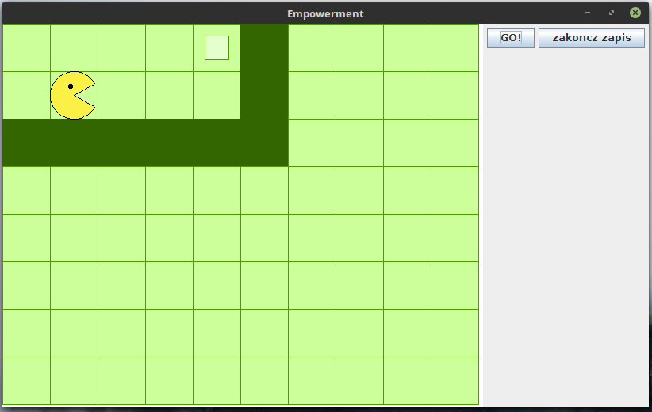
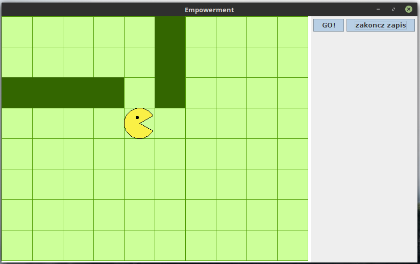

This program is inspired by [1].

An agent interacts with an environment (a 2d board) in order to maximize his empowerment.

On the board there are holes (dark green), blocks (white squares) and a ground (light green). Agent can walk, move or destroy blocks and fill up holes with blocks. When he walk in a hole, he can't come out.

In the following example agent takes a block and fill up a hole to increase a number of fields he can reach, which increases his empowerment.

1. Salge, C.; Glackin, C.; Polani, D.  Changing the Environment Based on Empowerment as Intrinsic Motivation. *Entropy* 2014, 16(5), 2789-2819.